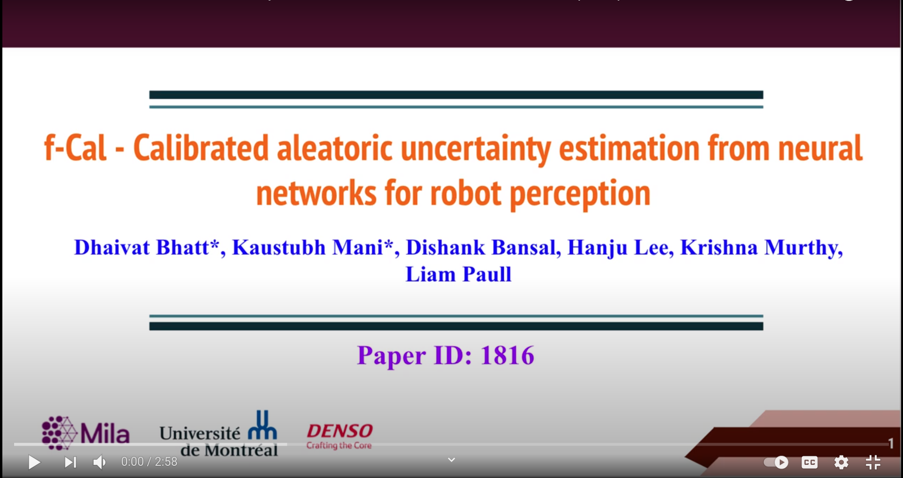
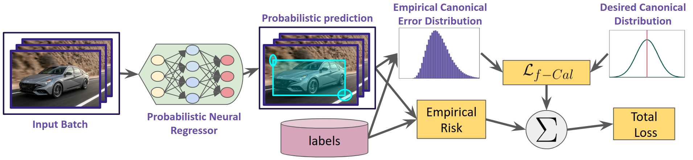
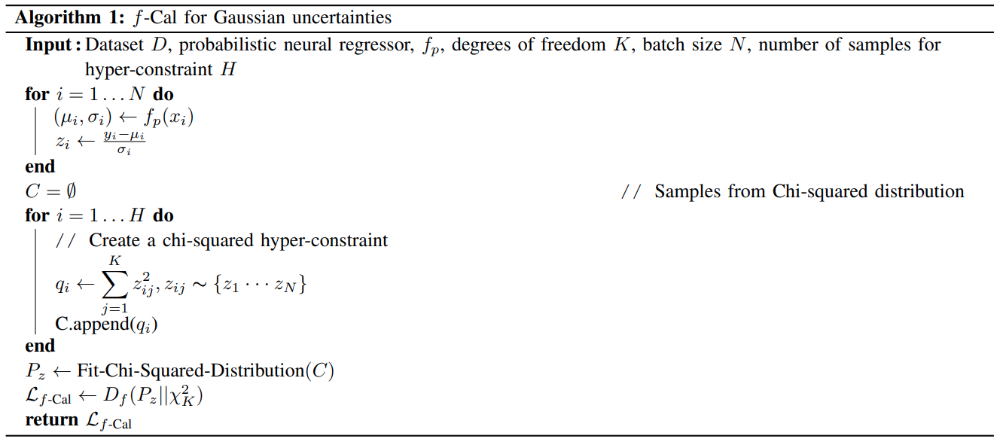
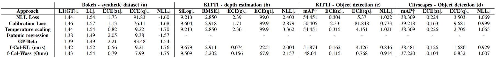
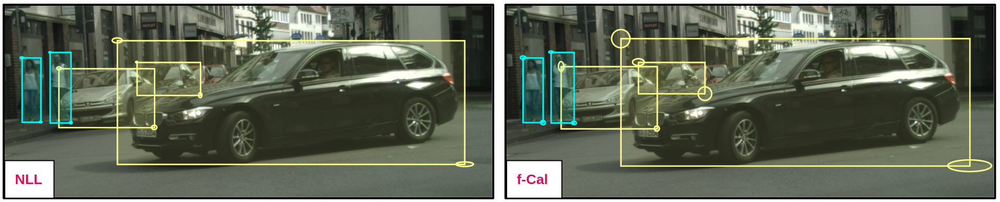
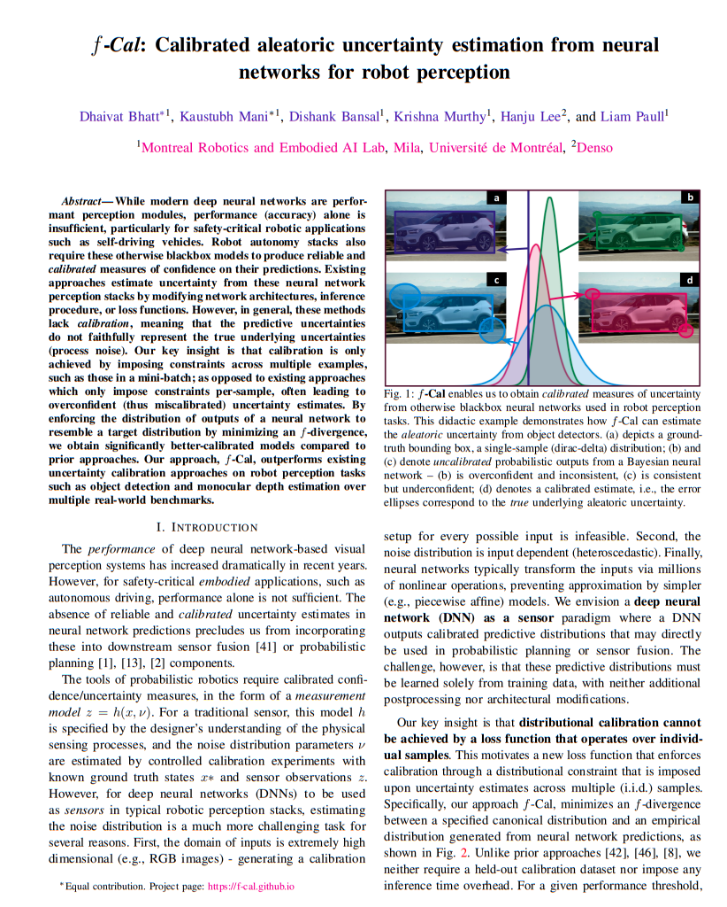

# *f*-Cal: Calibrated aleatoric uncertainty estimation from neural networks for robot perception

#### [Dhaivat Bhatt](https://dhaivat1729.github.io/), [Kaustubh Mani](https://scholar.google.com/citations?user=MnPjDIgAAAAJ&hl=en), [Dishank Bansal](https://mila.quebec/en/person/dishank-bansal/), [Krishna Murthy](https://krrish94.github.io), [Hanju Lee](https://www.linkedin.com/in/lee-hanju-1848323/?originalSubdomain=jp), and [Liam Paull](http://liampaull.ca)

# About
*f*-Cal is calibration method proposed to calibrate probabilistic regression networks. Typical bayesian neural networks are shown to be overconfident in their predictions. To use the predictions for downstream tasks, reliable and *calibrated* uncertainity estimates are critical. *f*-Cal is a straightforward loss function, which can be employed to train any probabilistic neural regressor, and obtain calibrated uncertainty estimates.

# Abstract

](https://youtu.be/2JVVfySNATM)


While modern deep neural networks are performant perception modules, performance (accuracy) alone is insufficient, particularly for safety-critical robotic applications such as self-driving vehicles. Robot autonomy stacks also require these otherwise blackbox models to produce reliable and calibrated measures of confidence on their predictions. Existing approaches estimate uncertainty from these neural network perception stacks by modifying network architectures, inference procedure, or loss functions. However, in general, these method slack calibration, meaning that the predictive uncertainties do not faithfully represent the true underlying uncertainties(process noise). Our key insight is that calibration is only achieved by imposing constraints across multiple examples, such as those in a mini-batch; as opposed to existing approaches which only impose constraints per-sample, often leading to overconfident (thus miscalibrated) uncertainty estimates. By enforcing the distribution of outputs of a neural network to resemble a target distribution by minimizing an f-divergence, we obtain significantly better-calibrated models compared to prior approaches. Our approach, *f*-Cal, outperforms existing uncertainty calibration approaches on robot perception tasks such as object detection and monocular depth estimation over multiple real-world benchmarks.

# Pipeline



***f*-Cal:** We make a conceptually simple tweak to the loss function in a typical (deterministic) neural network training pipeline. In addition to the empirical risk (e.g.,L1, L2, etc.) terms, we impose a distribution matching constraint over the error residuals  across  a  mini-batch.  By  encouraging  the  distribution  of  these  error  residuals  to  match  a  target calibrating  distribution(e.g.,Gaussian),  we  ensure  the  neural  network  predictions  are calibrated.  Compared  to  prior  approaches, most  of  which  perform  post-hoc calibration, or require large held-out calibration datasets, *f*-Cal does not impose an inference time overhead. *f*-Cal is task and architecture agnostic, and we apply it to robot perception problems such as object detection and depth estimation.

# Algorithm

*f*-Cal is a conceptually simple algorithm which can be implemented into any standard autodifferentiation tools such as [pytorch](https://pytorch.org) or [tensorflow](https://tensorflow.org). Through probabilistic neural regressor, we get a set of parameters as predictions for a ground-truth.  We construct residuals belonging to standard normal distribution from these predictions and ground-truth, and construct chi-squared distribution to calculate f-divergence. 



# Quantitative results:

We evaluate *f*-Cal for a wide range of robot perception tasks and datasets. In each column group (a, b, c, d), we report an empirical risk (deterministic performance metric such as L1, SiLog, RMSE, mAP), expected calibration errors (ECE), and negative log-likelihood. *f*-Cal consistently outperforms all other calibration techniques considered (lower ECE values). (**Note**: L1 scores are scaled by a factor of 1000 and ECE scores by a factor 100 for improved readability. ↓: Lower is better, ↑: Higher is better, −: Method did not scale to task/dataset) 



# Qualitative results:

## Object detection:
In object detection, we observe that NLL trained models yield substantially overconfident predictions, even for cars which are occluded. While *f*-Cal yields low uncertainty for objects with better visibility, while it estimates higher uncertainty for occluded objects. 



// In the sequence below, we show qualitatitve results for a KITTI sequence. In this temporal sequence, we could observe that *f*-Cal yields higher uncertainty estimates for occluded cars(on the right) which are difficult to identify, while yields confident predictions for objects with better visibility(on the left). 

// 

// # Depth estimation:


# Code snippet

Proposed loss function, *f*-Cal, is very simple to implement in a few lines of code. Here we provide a code snippet, implementing *f*-Cal, in under 30 lines of code. We implement distribution matching loss using wasserstein distance.

```python
import torch
from numpy.random import default_rng
from . import model ## our model to be trained

dataset_name = 'my_dataset'
dataloader = torch.utils.data.DataLoader(dataset_name) ## D x N, D x M
inputs, gts = iter(dataloader) ## B x N, B x M

## training procedure
## forward pass
mu, std_dev = model(inputs) ## B x M, B x M
gts, mu, std_dev = gts.flatten(), mu.flatten(), std_dev.flatten() ## BM x 1, BM x 1, BM x 1 

## constructing residuals
residuals = (gts - mu) / std_dev ##  BM x 1
                                                                                
## constructing a chi-squared variable
## random number generator, degrees of freedom(K in the paper), number of chi-squared samples 
rng, dof, cs_samples = default_rng(), 75, 100
                                                                     
chi_sq_samples = []  ## this will have our chi-squared samples
for i in range(cs_samples):
	indices = rng.choice(len(mu), size = dof, replace = False)
                                                                                
chi_sq_samples = torch.stack(chi_sq_samples)
mu1, mu2, var1, var2 = dof, chi_sq_samples.mean(), 2*dof, chi_sq_samples.var()
                                                                                
## loss computation
wasserstein_loss = ((mu1 - mu2)**2 + var1 + var2 - 2*(var1*var2)**0.5)
wasserstein_loss.backward()   

```

# Additional results and technical report:

We do extensive ablation about impact of our modeling assumption, perform analysis of calibration v/s accuracy tradeoff. We further define consistency and establish that calibration implies consistency and as we impose calibration constraints, we also yield consistency as a byproduct. We also show how *f*-Cal can be extended to non-Gaussian setups, and provide an example implementation for Laplace distribution. More details can be found in the following technical report.

[](https://f-cal.github.io/pdf/f-Cal-preprint.pdf)

# Colab notebook:
To play around with *f*-Cal quickly, we provide a [colab notebook](https://colab.research.google.com/drive/1s8B81yHvS9iYU9trVK4JTqAqlqudyePf?usp=sharing) for a very small toy experiment(different from the Bokeh dataset in the paper). Corresponding ipython notebook can be found [here](https://github.com/f-cal/f-cal.github.io/blob/main/notebook/f_Cal_Toy_Experiment.ipynb). 

